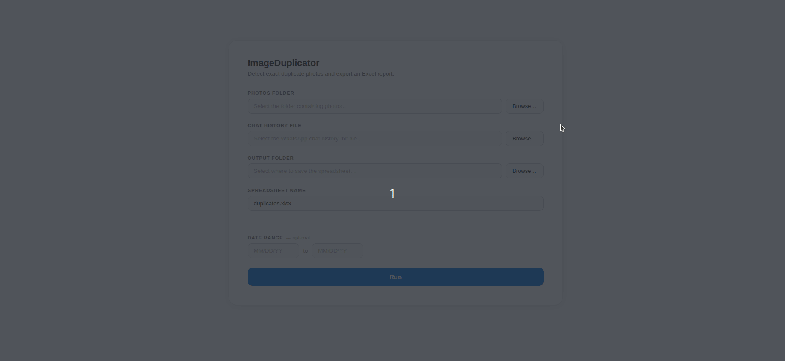
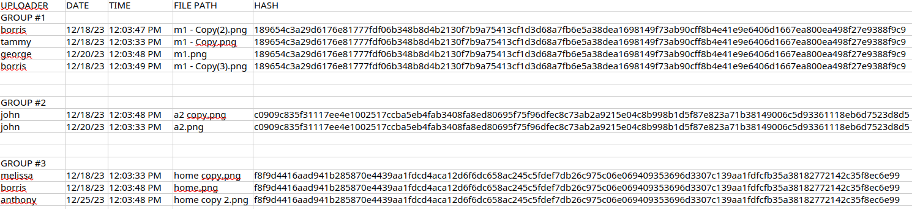
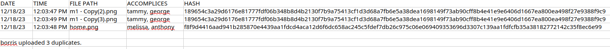

# ImageDuplicator — User Guide

Automatically finds employees who submitted the same photo more than once.

---

## What It Does

ImageDuplicator scans the photos from your WhatsApp group and finds exact copies. It then produces an Excel report showing who uploaded each duplicate and when, so you can review commission records accurately.

**Important:** The program only catches exact copies. If a photo has been cropped, filtered, resized, or edited in any way — even slightly — it will not be flagged as a duplicate.

---

## What You Need Before Running

- The **photos folder** downloaded from the WhatsApp group
- The **WhatsApp chat history** exported as a `.txt` file
- An internet connection **on the first run only** — the program installs its own requirements automatically and will not need to do this again

---

## How to Run

1. Double-click **"Run ImageDuplicator.command"**
2. A Terminal window will open and set itself up — no typing required
3. Your browser will open to the program's interface

  

4. Click **Browse…** next to **Photos Folder** and select the folder containing the downloaded photos
5. Click **Browse…** next to **Chat History File** and select the exported `.txt` file
6. Click **Browse…** next to **Output Folder** and select where you want the Excel file saved
7. Leave the spreadsheet name as-is, or type a new name if you prefer
8. Optionally, enter a **start and end date** to limit results to a specific time period
9. Click **Run**
10. Watch the output at the bottom of the page — when it says **"Exiting program, goodbye!"** your Excel file is ready, assuming no errors occured.

---

## Reading the Results

The Excel file contains two types of sheets.

### "Duplicate Photos" Sheet

Lists every group of unique identical photos found, labelled GROUP 1, GROUP 2, etc.

  

### Individual Name Sheets

There is one tab for each person who uploaded a duplicate. It lists every duplicate they submitted, and the last row shows their **total duplicate count**. The accomplices column is list of all other users who uploaded the same duplicate photo.

  

---

## Important Notes

- **Only exact copies are caught.** A photo that has been cropped, filtered, resized, or altered in any way will not be detected as a duplicate.

- **Display names must match exactly.** People are identified by the name shown in the WhatsApp chat history. If someone's display name changed over time, or appears with any variation (e.g. "Bob" vs. "Bob G"), those messages will be counted as two separate people.

- **The date filter affects the report, not the comparison.** When you enter a date range, the program still scans all photos in the folder — it only limits what appears in the final report. This means a photo from an older period can still be flagged as a duplicate of a newer one, and the number of duplicates found may be higher than a previous run if new photos have been added to the folder since then. **If a photo is flagged as a duplicate and there is only 1 photo in that group (the spreadsheet doesn't show the photo(s) it's a duplicate of) that means that the duplicates the program compared it with are outside of the date range you entered!** 

- **Photo searching is recursive**, i.e., whatever folder you tell the program to use for photos will search all nested folders inside that folder. To keep things simple, do not nest dump folders in one another.

---

## Troubleshooting

- **The browser didn't open automatically** — look for a web address in the Terminal window (it looks like `http://127.0.0.1/...`) and paste it into your browser manually.
- **The program shows a red error message** — scroll up in the terminal window to read the full message, then contact the person in charge of managing the code.
