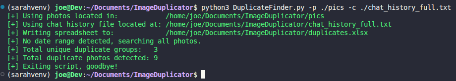
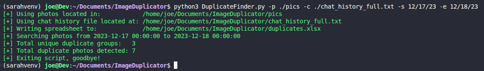
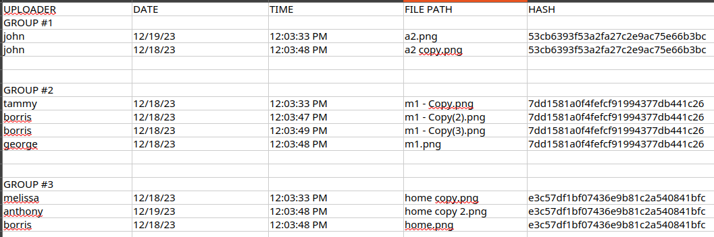
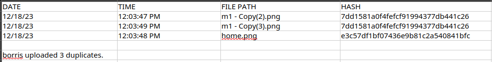

# Duplicate Finder
*Duplicatefinder.py* is a Python 3 script that will detect **EXACT** duplicate photos and output a Microsoft Excel spreadsheet with relevant information on the duplicates.

Specifically, this script will recursively search a folder and find all image files. The script will then md5 hash every image it found. Md5 is a cryptographic hash, which means that even the slightest change to the photo will alter the hash. **I.e., if a duplicate photo is even slightly modified (cropped, filtered, digital paint mark, etc.) it will not register as a duplicate! The tradeoff is that it is easier to submit duplicate photos, but we can guarantee that the duplicates being reported are accurate.**

 The script will then parse a WhatsApp chat history text file, and grab relevant information on duplicate uploads. This information is outputted to a Microsoft Excel spreadhseet. The first page on the spreadsheet is a list of all unique groups of duplicate photos, stating the uploaders, days/times, hashes, and photo paths on your computer. There is also a page for every offender who sends a duplicate photo. These per-person pages state the date/time, hahs, image path on your computer, and hash for each offense. At the bottom of the per-person page the total number of duplicates they uploaded will be notated.

## Dependencies
Below is all software you will need to run *DuplicatFinder.py*. If you are having trouble or lost on how to install `python3` or the `pip3` modules, Google or AI should be able to easily guide you if you paste in the command you want to use and any errors you get. Note that commands may be slightly different based on your operating system.

1. `python3` version 12 or higher
    - To see what version you have in your system:
        - Mac/Linux: `python3 --version` 
        - Windows: `python --version`
2. You will need to `pip3 install` certain Python modules (extra code to make our code run!) You can run the below commands individually. Note, on Windows you may have to omit the "3" and use `pip install` instead.
```
pip3 install argparse
pip3 install colorama
pip3 install filetype
pip3 install hashlib
pip3 install collections
pip3 install pandas
```

## How To Run the Script
The script takes in user input to find all of the required files, the file path of the Excel spreadhseet that will be outputted, and an optional date range to search. This means you can run the program from any folder on your computer, and it can look in any folder for photo folders and the chat history file, and output the spreadsheet where you want. There are default values if you do not specify any, but **it is highly recommended to specify all file paths so the person using the script is in control (`-p`, `c`, and `-o` options)!** 

If you ever forget what each option does, you can use the `-h` flag to print help info (and show default values), or refer to this *ReadMe*. 

Below are the options. Note each option has a shorthand `-h` and a lonhand `--help` which do the exact same thing! You only need to use one or the other.
```
  -h, --help            
        Descriotion: show this help message and exit

  -p <path to folder w/ photos>, --photos <path to folder w/ photos>
        Description: Path to the folder where the photos to be searched are located. (default: <folder you are running the program in>)

  -c <path to chat history file>, --chathistory <path to chat history file>
        Descriotion: Path to the WhatsApp chat history text file. (default: chat_history_full.txt)

  -o <desired Excel spreadsheet name>, --output <desired Excel spreadsheet name>
        Description: Choose the name of the Excel spreadsheet file that is generated on output. Can also state the path of the file. (default: duplicates.xlsx)
                        
  -s <start day>, --start_day <start day>
        Description: Optionally limit search of photos from start day to end day, -s and -e must exist together. (default: None)

  -e <start day>, --end_day <start day>
        Description: Optionally limit search of photos from start day to end day, -s and -e must exist together. (default: None)
```

- If you use a date range, you must state a start and end date.
- If you enter in bad data, the script will crash on purpose so you don't get bad data in your spreadsheet! Simply rerun the program with updated input.

## Ouput
- [+] (green text) means the program is running successfully
- [!] (yellow text) means the program is warning you about something
- [X] (red text) means the program encoutnered an error

## Example Usage
No date range used:  
  


With date range:  
 


Spreadhsheet list of all duplicates found:  
  


Spreadhsheet for single person:  
  


## Known Bugs
1. If files share the same name, the unique duplicate group (in the first spreadsheet) will have the same "fingerprint" (same row) for however many times the duplicate was found; i.e, all offenders besides the first won't be properly displayed in the spreadsheet.
2. **Only when using the date range**, the total unique duplicate groups number is not accurate! Excel will prints blank groups.
      - I.e., Excel won't show duplicates outside of the range, but will print blanks.
      - The `[+] Total unique duplicate groups:` line is larger than it actually is.

## Notes
- The **ACCOMPLICES** column on per-person sheets lists the other people who uploaded the same duplicate photo. Deduplication is name-based: if two different employees happen to share the same name, they will appear as one entry in each other's ACCOMPLICES column.

## WhatsApp Photo Naming Scheme
WhatsApp assigns each uploaded photo a filename based on a sequential message number and the exact timestamp of that message, for example: `00004499-PHOTO-2024-11-13-10-14-33.jpg`. Because the timestamp is tied to the *message*, not the *photo content*, the same image uploaded twice at different times will always produce two different filenames. This means:

- **True duplicate uploads are caught correctly.** If an employee sends the same photo twice, both messages get different filenames (different sequence numbers and timestamps). Both files land in the download folder with distinct names, the script finds matching hashes, and reports them as a duplicate group.
- **Files ending in ` (1)` cannot be matched to the chat history.** The ` (1)` suffix is added by your operating system when a file with that name already exists in the download folder — it is never part of the WhatsApp filename recorded in the chat log. This can happen if the photo archive is extracted or downloaded into the same folder more than once. The script will warn `[!] filename (1).jpg not found in chat history, skipping.` for each such file and exclude it from the results. These warnings do not indicate missed duplicates; they indicate files that cannot be traced back to a specific chat message.


### Notes:
- Originally phyl has dup groups even for a single photo! Likely do to mishandling of photos by the downloader causing (1) issues.
- The program will treat similar usernames as different people (e.g. bob_smith & bob_smith1 are seperate people)


Todo:
- web gui (open file explorer)
- read me
- break into seperate files
- make/auto-install dependencies
- audit code and verify results
- parse todos
- update comments